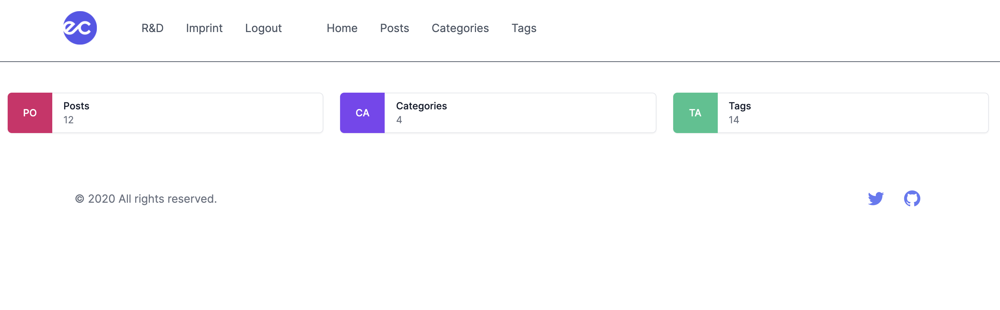
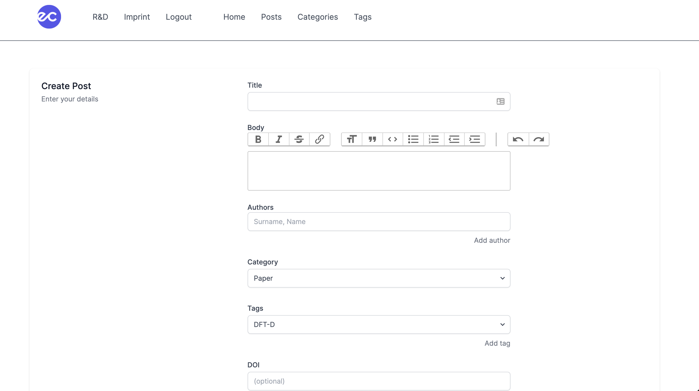

# Minimalistic blogsystem for scientists

A minimalistic blog system to present your own research and development. 
The blog system is built with the Laravel Framework and the design is created with Tailwind CSS (live demo: [eikecaldeweyher.de](https://eikecaldeweyher.de)).

# Installation
tba

# Login
Once you managed to install the blogsystem, you can login into the admin panel under ``/login``.
After a successful login, you will be redirected to the ``/home`` screen that shows the count of posts, categories, and tags.

# Posts

Create
-----
Click on the ``New Post`` button under ``/posts`` to create a new post (``/posts/create``).
On this page enter the details of your scientific achievment (title, abstract (termed body using a WYSIWYG editor), authors, categories, tags, DOI, cover).

Please note that you have to create categories and tags beforehand, such that you can use them here.

(Un)publish
-----------
Publish your added post under ``/posts`` using the ``Publish/Unpublish`` button.
The published post is now visible under ``/research``. Furthermore, each post has a unique hash-id that leads
to its detail page (e.g., ``/research/9m53vz2zo``). You can modify the settings for the hash-id in the ``config/hashid.php`` file
where you can choose your personal [salt](https://en.wikipedia.org/wiki/Salt_(cryptography)) as well as the lengths of the hash (default: ``9``) and the alphabet (default: ``abcdefghijklmnopqrstuvwxyz0123456789``) used to create the hash-id.

Edit
----
Once you created a post, you can edit each post under ``/posts`` using the ``Edit`` button next to its title.

# Categories

Create
------
Click on the ``New Category`` button to create a new category (``/categories/create``).

Edit
----
Once you created a category, you can edit each category under ``/categories`` using the ``Edit`` button next to its title.

# Tags

Create
------
Click on the ``New Tag`` button to create a new tag (``/tags/create``).

Edit
----
Once you created a post, you can edit each tag under ``/posts`` using the ``Edit`` button next to its title.
