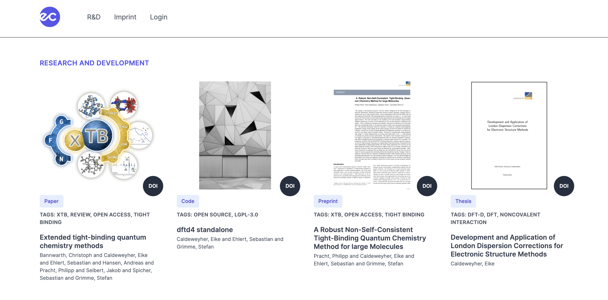

# Minimalistic responsive blogsystem for scientists
A minimalistic responsive blog system to present your research and development (live demo: [eikecaldeweyher.de](https://eikecaldeweyher.de)).

# Installation

This software makes use of the [Laravel](https://laravel.com/) Framework. Everything needed for running this project in production is included in this repository.

PHP 7.3+ and a SQL server is required. We suggest to use MySQL for this project, because everything was tested with this dbms.

After moving the project to a server, it can be installed with all dependencies with:

    $ composer install
    $ npm install && npm run dev

## Configuration

The whole project can be configured over a `.env` file which is loaded by Laravel automatically. The `.env.sample` can be copied and adjusted. A database has to be created before and the credentials have to be put in the `.env` file.

## Database migrations

To setup the database, run the migration command:

    $ php artisan migrate

This will create all needed tables.

## Coverimage storage
In order to save coverimages and make them available to the public use a new disk

```bash
mkdir storage/app/covers
```
and set the synlinks properly by

```bash
php artisan storage:link
```

# Login
Once you managed to install the blogsystem, you can login into the admin panel under ``/login``.
After a successful login, you will be redirected to the ``/home`` screen that shows the count of posts, categories, and tags.

<div align="center">

</div>

When you want to logout simply click on ``Logout`` within the navbar.

# Posts

Create
-----
Click on the ``New Post`` button under ``/posts`` to create a new post (``/posts/create``).
On this page enter the details of your scientific achievment (title, body (WYSIWYG editor), authors (livewire component), categories (dropdown), tags (livewire component), DOI (optional), cover).

<div align="center">

</div>


Please note that you have to create categories and tags beforehand, otherwise you won't pass the validation when submitting the create request.

(Un)publish
-----------
Publish your added post under ``/posts`` using the ``Publish/Unpublish`` button.
The published post is now visible under ``/research``. Furthermore, each post has a unique hash-id that leads
to its detail page (e.g., ``/research/9m53vz2zo``). 

You can modify the settings for the hash-id in the ``config/hashid.php`` file
where you can define your personal [salt](https://en.wikipedia.org/wiki/Salt_(cryptography)) as well as the length of the hash (default: ``9``) and the alphabet (default: ``abcdefghijklmnopqrstuvwxyz0123456789``) used to create the hash-id.

Edit
----
Once you created a post, you can edit each post under ``/posts`` using the ``Edit`` button next to its title.

Delete
------
Delete a post under ``/posts`` using the ``Delete`` button (be careful because there is no confirmation implemented so far).

# Categories

Create
------
Under ``/categories`` click on the ``New Category`` button to create a new category (``/categories/create``).

Edit
----
Once you created a category, you can edit each category under ``/categories`` using the ``Edit`` button next to its title.

Delete
------
Delete a category under ``/categories`` using the ``Delete`` button (be careful because there is no confirmation implemented so far).
Furthermore, this may cause a cascade deletion of several posts.

# Tags

Create
------
Under ``/tags`` click on the ``New Tag`` button to create a new tag (``/tags/create``).

Edit
----
Once you created a tag, you can edit each tag under ``/tags`` using the ``Edit`` button next to its title.

Delete
------
Delete a tag under ``/tags`` using the ``Delete`` button (be careful because there is no confirmation implemented so far).
Furthermore, this may cause a cascade deletion of several posts.


# Research

Index
-----
Under ``/research`` all published posts are visible to anybody.

<div align="center">

</div>

Detail
------
Every published post has its own detail page (see above for details).
